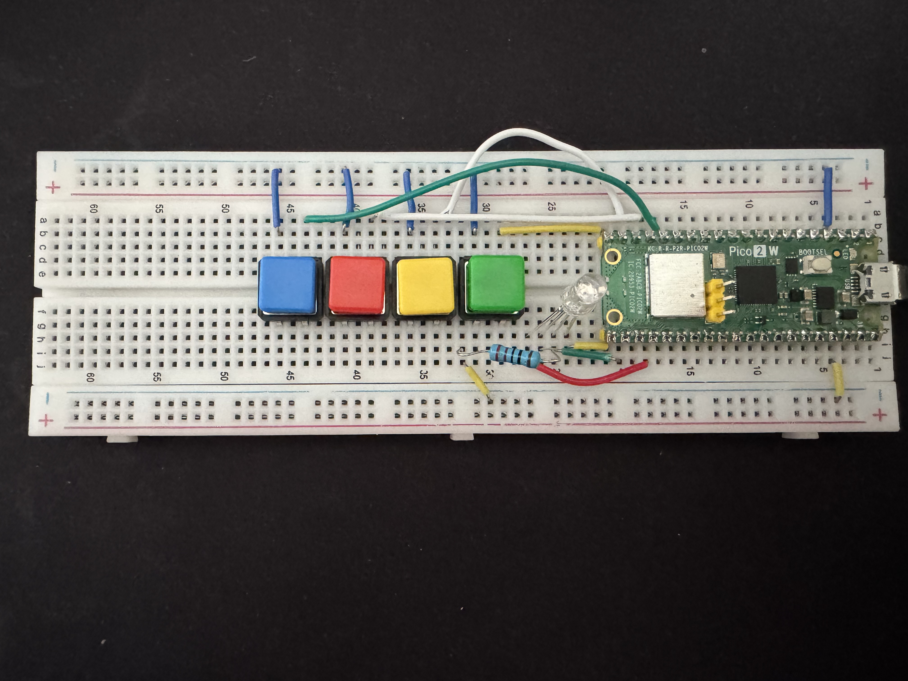

# Lesson 14B - Push Buttons and RGB LED

Reference video

[Paul McWhorter - Lesson 17](https://www.youtube.com/watch?v=OkaUMOH6CSI&list=PLGs0VKk2DiYz8js1SJog21cDhkBqyAhC5&index=17)

## Objective

Use multiple push buttons with pull-up resistors to control an RGB LED with PWM.
Each button toggles one channel or a color combination.

## Code

- `main.py`

## Photo

Current photo file:

## Video

Current video file:

[Watch demo video](demo.mp4)

## Expected Behavior

1. Pressing the red button toggles the red channel.
2. Pressing the green button toggles the green channel.
3. Pressing the blue button toggles the blue channel.
4. Pressing the yellow button toggles yellow using red + green.
5. A button press is detected once per press using edge detection.

## What You Practice

- Reading multiple digital inputs
- Using `Pin.IN` with `Pin.PULL_UP`
- Edge detection with previous-state tracking
- PWM output control with `duty_u16`
- RGB color mixing
- Basic debounce with short delays

## Note

With pull-up inputs, a released button reads `1` and a pressed button reads `0`.
If colors look different than expected, verify RGB channel wiring and LED type (common cathode vs common anode).
